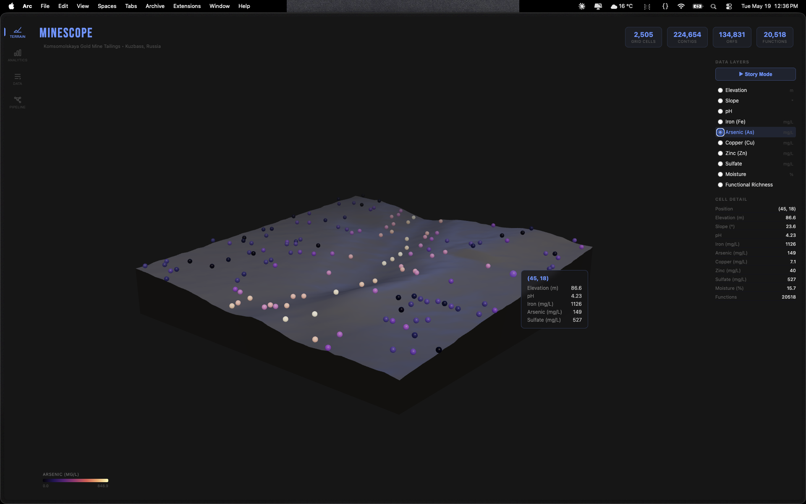
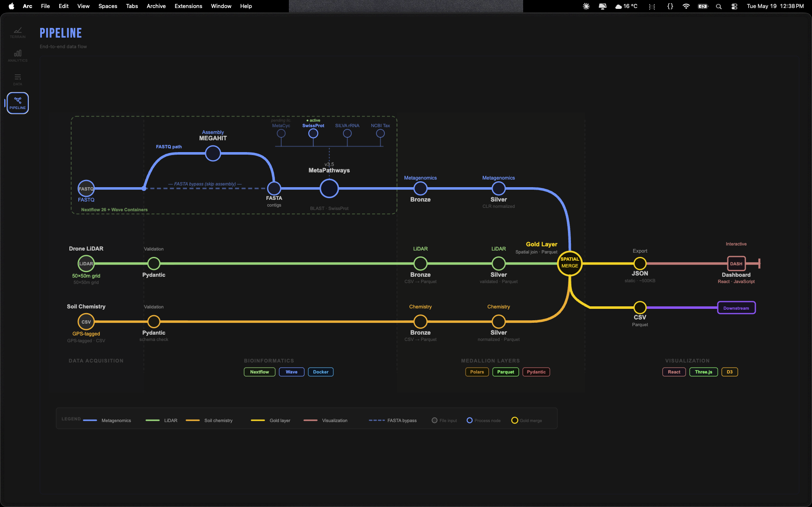

# MineScope

**Map microbial community activity onto the physical and chemical landscape of a mine site.**



## Why This Matters

Acid mine drainage (AMD) is one of the most persistent environmental challenges in mining. When sulphide minerals are exposed to water and air, sulphur-oxidizing bacteria like *Acidithiobacillus thiooxidans* catalyze the production of sulfuric acid. This dissolves heavy metals — iron, arsenic, copper, zinc — into drainage water, contaminating downstream ecosystems for decades. The key insight is that this isn't random: physical terrain drives where water flows, water flow drives where chemistry concentrates, and chemistry drives where these microbial communities assemble. Understanding this spatial cascade is the difference between reactive cleanup and predictive management.

MineScope integrates three data streams — metagenomics sequencing, LiDAR terrain mapping, and soil chemistry — into a unified spatial model. Every grid cell on the mine site gets a complete profile: what the terrain looks like, what the chemistry is, and what the microbial community is doing. The result is a platform that shows not just *where* AMD is happening, but *why* it's happening there — and where it will happen next.

**[→ Live Dashboard](https://hrrysprk.github.io/MineScope/)** · **[→ Pipeline Diagram](https://hrrysprk.github.io/MineScope/#pipeline)**

---

## Architecture

```
┌─────────────────────────────────────────────────────────────────────────────┐
│                         Nextflow 26 + Wave Containers                       │
│                                                                             │
│  FASTQ ──→ MEGAHIT Assembly ──→ MetaPathways v3.5 ──→ BLAST output         │
│            (224K contigs)        (SwissProt annotation)  (220K hits)         │
└─────────────────────────────────────────────────────────────────────────────┘
                                        │
                                        ▼
┌──────────────┐    ┌──────────────┐    ┌──────────────┐
│   Bronze     │    │   Silver     │    │    Gold      │
│  Raw data    │───▶│  Validated   │───▶│  Integrated  │──▶ Dashboard
│  + Pydantic  │    │  + Parquet   │    │  Spatial     │
│  validation  │    │  + CLR norm  │    │  Merge       │
└──────────────┘    └──────────────┘    └──────────────┘
       ▲                                        │
       │                                        ▼
  LiDAR Grid ─────────────────────────────▶ 2,505 cells × 18 columns
  Soil Chemistry ─────────────────────────▶ (x,y) spatial join
```

Three parallel data streams converge through a medallion architecture into a single gold layer. Each cell in the gold layer contains terrain topology, soil chemistry, and microbial functional annotation — merged on spatial coordinates.

---

## Design Decisions

| Decision | Why |
|----------|-----|
| **Hexagonal ports & adapters** | Each data source gets its own adapter. If the LiDAR format changes from CSV to GeoTIFF, only the adapter changes — domain logic stays untouched. |
| **Medallion layers (Bronze → Silver → Gold)** | Clear data lineage. Every value is traceable back to its raw source. Validation at every boundary catches corruption early. |
| **MetaPathways v3.5 containerized via Wave** | Koonkie's own pathway reconstruction tool, running in Docker with automatic multi-arch provisioning. Same pipeline runs on Apple Silicon, x86 servers, and cloud HPC without configuration changes. |
| **D8 flow direction encoding** | Industry-standard hydrology encoding (powers of 2 for 8 compass directions). Any GIS tool recognizes it. Derived from terrain aspect — tells us where water flows at every cell. |
| **Pydantic at every boundary** | Schema-as-code. Constraints encode domain knowledge: pH can't exceed 14, concentrations can't be negative, slope can't be negative. Bad data fails at ingestion, not silently downstream. |
| **Polars over Pandas** | Type-strict, native Parquet I/O, 5-10x faster. Aligns with the validation-first philosophy. |
| **Seqera Platform (Tower)** | Pipeline runs are tracked in [Seqera Cloud](https://cloud.seqera.io). Full provenance, monitoring, and scheduling for production deployment. |
| **CLR normalization in Silver** | Centered log-ratio transformation prepares functional counts for multi-sample comparison. Ready for when per-location metagenomes arrive. |

---

## Data Sources

| Stream | Source | Details |
|--------|--------|---------|
| Metagenomics | [SRR6189722](https://www.ncbi.nlm.nih.gov/sra/SRR6189722) (NCBI SRA) | Gold mine tailings metagenome, Kuzbass Russia. 454 GS FLX Titanium, single-end, 438K reads. Annotated with [MetaPathways v3.5](https://bitbucket.org/BCB2/metapathways/) (Hallam Lab, UBC). |
| LiDAR | Synthetic (realistic) | 50×50m grid at 1m resolution. Drainage channels, ridge lines, tailings mound, excavation pit. Based on published mine site topography. |
| Soil Chemistry | Synthetic (realistic) | 150 GPS-tagged samples. pH 1–5, Fe up to 6000 mg/L, As up to 800 mg/L. Values correlated with terrain drainage — based on published chemistry from the SRR6189722 paper. |

---

## Quick Start

**Prerequisites:** Python 3.12+, Node.js 18+, Docker, [Nextflow](https://nextflow.io), [uv](https://docs.astral.sh/uv/)

```bash
# Clone
git clone https://github.com/hrrysprk/MineScope.git
cd MineScope

# Install Python dependencies
uv sync

# Generate synthetic data
uv run python scripts/data_generation/generate_lidar.py
uv run python scripts/data_generation/generate_chemistry.py

# Run the data pipeline (bronze → silver → gold → dashboard JSON)
uv run python scripts/run_pipeline.py

# Start the dashboard
cd dashboard
npm install
npm run dev
# Open http://localhost:5173
```

**Full pipeline (requires Docker + reference databases):**
```bash
nextflow run main.nf -profile docker \
  --input_fastq data/bronze/metagenomics/SRR6189722.fastq
```

See [SETUP.md](SETUP.md) for database configuration and full pipeline setup.

---

## Pipeline Detail

### Nextflow Bioinformatics Pipeline

| Process | Tool | Input | Output |
|---------|------|-------|--------|
| `ASSEMBLE_READS` | MEGAHIT | Single-end FASTQ | Assembled contigs (FASTA) |
| `PATHWAY_PROFILING` | MetaPathways v3.5 | Contigs + SwissProt DB | Functional annotations (BLAST output) |

Conditional bypass: if pre-assembled contigs exist (`--input_fasta`), assembly is skipped. Supports both Docker and Conda execution profiles.

### Python Data Pipeline

| Layer | Transform | Output |
|-------|-----------|--------|
| Bronze → Silver (LiDAR) | CSV → Parquet | Validated terrain grid |
| Bronze → Silver (Chemistry) | CSV → Parquet | Validated sample points |
| Bronze → Silver (Metagenomics) | BLAST → best hit per ORF → functional counts + CLR | Normalized pathway abundance |
| Silver → Gold | Spatial join on (x, y) coordinates | Unified 2,505 × 18 Parquet |

---

## Biological Interpretation

The dashboard reveals the AMD spatial cascade:

1. **Elevation layer** — The drainage channel is visible as a blue-green trough running diagonally across the site. Water accumulates here.

2. **pH layer** — Acidity concentrates along the drainage path (pH 1.2–2.5 in the channel vs 4+ on ridges). This is where sulfuric acid pools.

3. **Iron layer** — Dissolved iron peaks where pH is lowest (>6000 mg/L in the channel). Classic AMD geochemistry signature.

4. **Pathway enrichment** — The top annotated functions from MetaPathways are biofilm signaling, heavy metal efflux, and cation resistance. These are survival strategies for organisms living in extreme metal/acid conditions.

The pattern confirms: **terrain → chemistry → biology**. The microbial community isn't randomly distributed — it's spatially organized by the physical and chemical landscape.



---

## Tech Stack

| Layer | Technology |
|-------|-----------|
| Pipeline orchestration | Nextflow 26 + Wave containers |
| Pipeline monitoring | [Seqera Platform](https://cloud.seqera.io) (Tower) |
| Assembly | MEGAHIT (containerized) |
| Pathway annotation | MetaPathways v3.5 (containerized) |
| Data processing | Python 3.12, Polars, Pydantic |
| Package management | uv (lockfile-based reproducibility) |
| 3D Visualization | React, Three.js, React Three Fiber |
| Charts | D3.js |
| Deployment | GitHub Pages (static) |

---

## Project Structure

```
MineScope/
├── main.nf                    # Nextflow pipeline (assembly → annotation)
├── nextflow.config            # Wave containers, Docker/Conda profiles
├── modules/
│   ├── assemble_reads.nf      # MEGAHIT process
│   └── pathway_profiling.nf   # MetaPathways process
├── src/
│   ├── adapters/              # Hexagonal ports (one per data source)
│   │   ├── chemistry/reader.py
│   │   ├── lidar/reader.py
│   │   └── metagenomics/reader.py
│   ├── domain/models/         # Pydantic schemas
│   │   ├── chemistry.py
│   │   ├── lidar.py
│   │   └── pathway.py
│   └── layers/                # Medallion transforms
│       ├── silver/            # Validation + normalization
│       └── gold/              # Spatial merge
├── scripts/
│   ├── data_generation/       # Synthetic LiDAR + chemistry
│   └── run_pipeline.py        # Bronze → Silver → Gold orchestration
├── dashboard/                 # React + Three.js + D3
│   └── src/
│       ├── components/        # TerrainViewer, RadarChart, HeatmapGrid...
│       └── pages/             # Terrain, Analytics, Data, Pipeline
├── data/
│   ├── bronze/                # Raw inputs
│   ├── silver/                # Validated Parquet
│   └── gold/                  # Integrated spatial dataset
└── databases/                 # MetaPathways reference DBs (not in repo)
```

---

## Roadmap

- [ ] Automated protein-to-function mapping for pathway enrichment (replace manual accession lookup)
- [ ] Per-location metagenomes for true spatial resolution of functional profiles
- [ ] MetaCyc integration when institutional license access is resolved
- [ ] Multi-format amplicon pipeline: FASTQ, QIIME2 artifacts, OTU tables, BIOM format
- [ ] Time-series monitoring via Seqera Platform (scheduled pipeline runs + threshold alerts)
- [ ] AMD risk score — composite spatial index for predictive site management

---

## License

MIT
